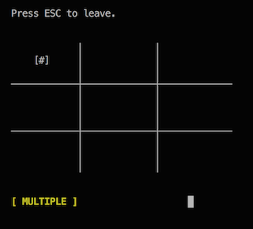
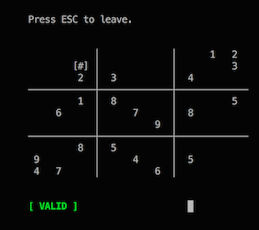

# sdsolve

## Contents

* Checker
* Basic (stupid) solver
* Advanced (backtrack) solver
* Command-line interface for composing puzzles
* Basic sudoku problem generator
* [**Android app**](https://codeberg.org/theoden8/sudaku)

## Usage

### Compiling

    make

### Running

#### Checker/solver

```
$ ./sudoku_checker # ./sudoku_solver # ./sudoku_advanced
3
0 0 0 0 0 0 0 0 0
0 0 0 0 0 0 0 0 0
0 0 0 0 0 0 0 0 0
0 0 0 0 0 0 0 0 0
0 0 0 0 0 0 0 0 0
0 0 0 0 0 0 0 0 0
0 0 0 0 0 0 0 0 0
0 0 0 0 0 0 0 0 0
0 0 0 0 0 0 0 0 0
```

#### UI

```
$ ./sudoku_ui
3
0 0 0 0 0 0 0 0 0
0 0 0 0 0 0 0 0 0
0 0 0 0 0 0 0 0 0
0 0 0 0 0 0 0 0 0
0 0 0 0 0 0 0 0 0
0 0 0 0 0 0 0 0 0
0 0 0 0 0 0 0 0 0
0 0 0 0 0 0 0 0 0
0 0 0 0 0 0 0 0 0
```



* Arrows to navigate
* **ENTER** to evaluate status
* **ESC** to leave

```
  3
    0  0  0  0  0  0  0  0  0
    0  0  0  0  0  0  0  0  0
    0  0  0  0  0  0  0  0  0
    0  0  0  0  0  0  0  0  0
    0  0  0  0  0  0  0  0  0
    0  0  0  0  0  0  0  0  0
    0  0  0  0  0  0  0  0  0
    0  0  0  0  0  0  0  0  0
    0  0  0  0  0  0  0  0  0
```



* Numbers to set the value
* **TAB** to complete the cell for a unique solution

```
  3
    0  0  0  0  0  0  0  1  2
    0  0  0  0  0  0  0  0  3
    0  0  2  3  0  0  4  0  0
    0  0  1  8  0  0  0  0  5
    0  6  0  0  7  0  8  0  0
    0  0  0  0  0  9  0  0  0
    0  0  8  5  0  0  0  0  0
    9  0  0  0  4  0  5  0  0
    4  7  0  0  0  6  0  0  0
```

#### Generator

```
$ time ( ./sudoku_generator 5 )
  5
  0  2  0  0  0  9 17  0 10 13 18  0 15  0 25  4 14  1  0  0  0  0  0  5  0
  0  4  0  0  0  3 21  0  0  0  1  0  0  0  0  0  0  0 10  0 17  0  0 11  0
  1  0  0  6 20  0  0 16  0 23  0  0 24  0 17 11 22 12  2  0  0  0  0  7 13
  3 16  0  0 13  0  1  0 11  4  0  0 20 19 10  6  0  0  0  0  0 25  0  0  0
  5  0  0  7  0 18  0  0 12  0  0  0 23  0  0 17 20  0  0  0 21 22 19  1  0
  0  0  0 12  3  0  0 17 22  0  9  0  6  0  0 16 11 24  0  0  0  1  0 15  0
  0 10  4 23 25  0 14 13  3  0  0  0  0 21  0  7  8  0  0  0  6  9  0  0 19
  0 11 19  0 21 12  0  0  0  9 24  5  0  8  0  0  1 20 22  0  4 16  0  0 10
  0  0  0 18 16  0  8 20  0  2 14  0  0 25 19  0 10  0 21 17  0 23  0 24  0
  0  0  0  0 24  0  0  0 21  0 23  3  4  0  0 18  0  6  0  0  0  0  0  0  0
  0  0  2  0  0  0  4  0 19  0 25  1  0 14  0  0 16 23  0  0  8 11  0  0  0
  0  0  0  0 15  0 16 10 23  0 22  0  0  0  0 12  0  0  7  0  0 13  9  0  0
  0 20  0  0  6  0  0  0 25 21  0  0 19  0 23  0  3  0  4  0 22  0  7 10  1
  4 13  9 16 12 14  0  0  0  3 10  8  2  7  0  0  0  0  0  0 23 24  0 17  5
 23  0  3  0 18  7  6 12  0  8 13  0  9  0  0  0  5  0  0  0 19  0 16  0  0
  0  0 17  2  0  0  0  0  6  7 20  0  0  0  1 19 23  0 11 10  0  0  0 21  0
 25  0  0 21  0 13  0  1 17  5  7  0  0  0  0  0  0 18  9  2 11  0  3  0  0
  0  0 13  0  0 23 11  0  0  0  0  0  0  6  5  0  4 16  0  0  0  0  0 19 14
  0  0 23  0  0  0 20  0  4  0  2 15 18  0  8 14 21  0  0  0 10  0  0 22  0
 16  3 14  0  0  0  0 24  0  0  4  0  0 11  0 15  0 22  5  7 20  2  0 23  0
 15  0 22  0  2 20  0 11 16 14  6 10  7  0 24  1 13  9  0  4  0 19  0  0  0
 19  0  5 13  0  0 12 18  0 17  0  0  0  0  0  0  6 14  0  0 24  7 10  0 15
 18  0  0  3  0  0 19 23  0  0  0 20  0  1  0  5  0  7 24  0  0 17  0 13  4
 11 23 20  4  0  0  0  0 13 24  0  2 21  0  0 10  0  0  0  3  0  0  0  0  9
  0  0  6 10  0  1  2  4  0  0  0 25 13 17  0 21 18  8  0 20  0  3  0 14 22
( ./sudoku_generator 5; )  33.32s user 0.23s system 98% cpu 33.976 total
```

Now, we will check how hard it is for the advanced solver to finish:

```
$ time ( ./sudoku_advanced < input.txt )
 21  2 12 11 19  9 17  7 10 13 18  6 15 22 25  4 14  1  8 16  3 20 24  5 23
 22  4 18  9 23  3 21 19 20 25  1  7  8  2 12 13 24  5 10 15 17  6 14 11 16
  1  8 25  6 20 15  5 16 14 23 21  9 24  3 17 11 22 12  2 19 18 10  4  7 13
  3 16 24 17 13 22  1  8 11  4  5 14 20 19 10  6  7 21 18 23 15 25  2  9 12
  5 14 15  7 10 18 24  2 12  6 11 16 23 13  4 17 20 25  3  9 21 22 19  1  8
 20  5  8 12  3  4 23 17 22 19  9 18  6 10  2 16 11 24 13 14  7  1 21 15 25
 17 10  4 23 25 24 14 13  3  1 12 22 11 21 16  7  8  2 15  5  6  9 20 18 19
  2 11 19 14 21 12 18  6  7  9 24  5 17  8 15 23  1 20 22 25  4 16 13  3 10
  6  9  7 18 16  5  8 20 15  2 14 13  1 25 19  3 10  4 21 17 12 23 22 24 11
 13 22  1 15 24 16 10 25 21 11 23  3  4 20  7 18  9  6 19 12 14  5  8  2 17
 10  7  2 22  5 17  4  9 19 18 25  1  3 14 21 24 16 23  6 13  8 11 15 12 20
 14 19 21  1 15 11 16 10 23 20 22  4  5 24 18 12  2 17  7  8 25 13  9  6  3
  8 20 11 24  6  2 13  5 25 21 17 12 19 16 23  9  3 15  4 18 22 14  7 10  1
  4 13  9 16 12 14 22 15  1  3 10  8  2  7  6 25 19 11 20 21 23 24 18 17  5
 23 17  3 25 18  7  6 12 24  8 13 11  9 15 20 22  5 10 14  1 19 21 16  4  2
  9 15 17  2 22  8 25 14  6  7 20 24 16 12  1 19 23  3 11 10 13  4  5 21 18
 25  6 10 21  4 13 15  1 17  5  7 19 14 23 22 20 12 18  9  2 11  8  3 16 24
 12 18 13 20  7 23 11 21  2 22  3 17 10  6  5  8  4 16  1 24  9 15 25 19 14
 24  1 23  5 11 19 20  3  4 16  2 15 18  9  8 14 21 13 25  6 10 12 17 22  7
 16  3 14 19  8 10  9 24 18 12  4 21 25 11 13 15 17 22  5  7 20  2  1 23  6
 15 12 22  8  2 20  3 11 16 14  6 10  7 18 24  1 13  9 17  4  5 19 23 25 21
 19 25  5 13  1 21 12 18  9 17  8 23 22  4  3  2  6 14 16 11 24  7 10 20 15
 18 21 16  3 14  6 19 23  8 10 15 20 12  1  9  5 25  7 24 22  2 17 11 13  4
 11 23 20  4 17 25  7 22 13 24 16  2 21  5 14 10 15 19 12  3  1 18  6  8  9
  7 24  6 10  9  1  2  4  5 15 19 25 13 17 11 21 18  8 23 20 16  3 12 14 22
( ./sudoku_advanced < input.txt; )  18.04s user 0.04s system 99% cpu 18.157 total
```

### Testing

### Checker, solvers

    ./test_all

### Generator

```
$ for i in {1..10000}; do ./sudoku_generator 3 > input.txt; time ( ./sudoku_solver <input.txt >/dev/null ); done 2>&1 | cut -d ' ' -f 15 | sort -n --reverse | head
0.197
0.059
0.056
0.049
0.049
0.044
0.037
0.037
0.034
0.034
```

```
$ for i in {1..1000}; do ./sudoku_generator 4 > input.txt; time ( ./sudoku_advanced <input.txt >/dev/null ); done 2>&1 | cut -d ' ' -f 15 | sort -n --reverse | head
0.072
0.064
0.059
0.058
0.050
0.045
0.044
0.043
0.039
0.035
```

## Capabilities

* Checker: none, it's useless

* Basic solver:
  
     - Possible values stored in bits
     - Recursion heuristics for least possibilities on a cell

* Advanced solver:
  
     - Algorithm X
     - Arrays instead of sparse matrices
     - Forward heuristics: minimal number of solutions for a constraint
     - Error heuristics: maximum number of deadends for the constraint

* Puzzle composer:
  
     - ncurses + advanced solver
     - Arrows
     - Setting/unsetting values
     - Validation
     - Completion (of a particular cell)
     - Exit

* Puzzle generator:
  
     - Puts random values into sudoku, solves it, and unsets random values
     - Uses advanced solver
     - Uses `clock(3)` to evaluate the difficulty.

## Note

Submitted as a 2-week coursework for CS2002 at the University of St Andrews.
